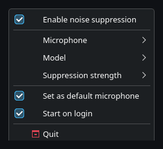
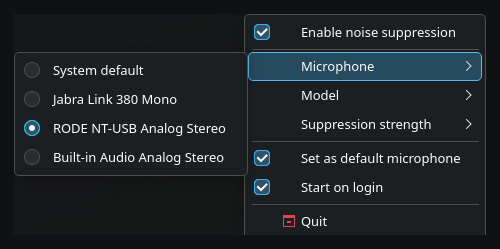
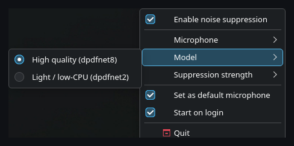
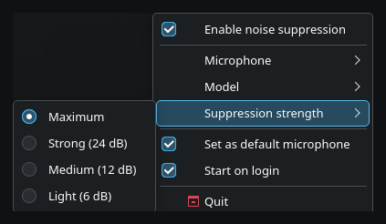

<h1 align="center">
  <br>
  HushMic
</h1>

<p align="center">
  <b>Real-time microphone noise suppression for Linux, as a system-wide virtual mic.</b><br>
  Open source, runs on the CPU, your audio never leaves the machine.
</p>

<p align="center">
  <a href="https://github.com/Fovty/hushmic/releases"></a>
  <a href="#license"></a>
  <a href="https://github.com/Fovty/hushmic/actions/workflows/release.yml"></a>
</p>

HushMic creates a virtual microphone that strips out keyboard clatter, fans, and background chatter in real time. Select **"HushMic"** as your input in any app — Discord, TeamSpeak, browsers, OBS, games — and that's it. No EasyEffects graphs to wire up, no terminal, no `setcap`.


## Demo

Each clip plays the **noisy input**, then the same audio **cleaned by HushMic** — a neutral public-domain voice over real background noise.

<table>
<tr>
<td align="center"><b>Keyboard</b></td>
<td align="center"><b>Fan / AC hum</b></td>
<td align="center"><b>Café chatter</b></td>
</tr>
<tr>
<td><video src="https://github.com/user-attachments/assets/d50be6f1-2f1d-41c3-b92c-9640174c2db5" controls width="280"></video></td>
<td><video src="https://github.com/user-attachments/assets/645d4378-61e8-454d-8af3-8b394264fe66" controls width="280"></video></td>
<td><video src="https://github.com/user-attachments/assets/1c644272-d8a0-41fd-be4e-68e8208e6faf" controls width="280"></video></td>
</tr>
</table>

Background noise drops ~27–28 dB while the voice is preserved; demo-audio credits are in [Credits](#credits).

## Why

I wanted Krisp-level noise suppression on Linux for TeamSpeak, and there wasn't a maintained, packaged option that _just worked_ as a virtual mic. The model quality exists in the open-source world — it just wasn't wrapped into something you install and toggle on.

So I benchmarked the realistic contenders on my own recordings, picked the one that scored best (it actually edged out Krisp), and built the missing pieces around it: a real-time plugin and a tray app that manages everything.

### How it compares

A small bake-off on my own recordings — 7 noise scenarios (keyboard, fan, AC, chatter, …), scored with **DNSMOS P.835** (a reference-free MOS estimator). These are indicative numbers from one person's setup, not a formal benchmark, but they're why HushMic uses DPDFNet:

| Model                           | Overall (OVRL) | Background (BAK) | Speech (SIG) |
| ------------------------------- | :------------: | :--------------: | :----------: |
| **DPDFNet** — _HushMic's model_ |    **3.04**    |     **4.11**     |   **3.32**   |
| DeepFilterNet 3                 |      3.01      |       4.07       |     3.30     |
| GTCRN                           |      2.73      |       3.93       |     3.08     |
| Krisp _(v9.9.3)_                |      2.71      |       4.01       |     3.00     |
| khip _(older Krisp model port)_ |      2.60      |       3.97       |     2.87     |

_(Averaged over the 7 scenarios; higher is better, 1–5.)_ DPDFNet came out on top on every axis — overall, background-noise removal, and voice preservation — narrowly ahead of DeepFilterNet 3 and more clearly ahead of the rest, and a blind listen on my own clips agreed. ([DPDFNet](https://github.com/ceva-ip/DPDFNet) is a DeepFilterNet-lineage model from Ceva; [arXiv:2512.16420](https://arxiv.org/abs/2512.16420).)

## Features

- One virtual microphone, usable by any PipeWire- or PulseAudio-compatible app.
- A tray menu for everything: on/off, which mic to clean, model (quality vs. light), suppression strength, set-as-default, start-on-login.
- The audio runs inside PipeWire's own graph, so the mic keeps working even if the tray app is closed or crashes — and it needs no elevated privileges (`setcap`).
- Re-creates itself automatically after a PipeWire restart or a suspend/resume, and puts your previous default mic back when you quit.
- ~0.3× real-time on a desktop CPU; no GPU, no network.

## Requirements

- Linux with **PipeWire** (+ `pipewire-pulse` for PulseAudio apps) and WirePlumber.
- A system tray (StatusNotifierItem): native on KDE Plasma and most desktops. On **GNOME**, install the _AppIndicator and KStatusNotifierItem Support_ extension.
- x86-64.

## Install

**Any distro** (install script, system-wide):

```bash
curl -fsSL https://raw.githubusercontent.com/Fovty/hushmic/main/scripts/install.sh | sudo sh
```

**Debian / Ubuntu** (`.deb`):

```bash
curl -fsSLO https://github.com/Fovty/hushmic/releases/latest/download/hushmic_0.1.2-1_amd64.deb
sudo apt install ./hushmic_0.1.2-1_amd64.deb
```

**AppImage** (any distro, no install):

```bash
curl -fsSLO https://github.com/Fovty/hushmic/releases/latest/download/hushmic-x86_64.AppImage
chmod +x hushmic-x86_64.AppImage
./hushmic-x86_64.AppImage --tray
```

## Usage

Launch HushMic from your desktop's application menu, or from a terminal:

```bash
hushmic --tray
```

A tray icon appears. Open it, **Enable**, pick your **Microphone**, and choose **"HushMic"** as the input in your app. Or flip **Set as default microphone** and everything that respects the system default uses it automatically. The same menu has the model picker (`dpdfnet8` = quality, `dpdfnet2` = lighter), suppression strength, and a start-on-login toggle.

<p align="center">
  
</p>

<details>
<summary><b>More screenshots</b> — microphone picker, model picker, suppression strength</summary>

<p align="center">
  
  
  
</p>

</details>

## Configuration

State lives in `~/.config/hushmic/config.toml` (most of it is in the tray menu):

```toml
enabled     = true
mic         = "alsa_input.usb-RODE..."   # source node name; omit for system default
model       = "dpdfnet8_48khz_hr"        # or "dpdfnet2_48khz_hr" (lighter)
attn_limit  = 100.0                        # suppression cap in dB (higher = stronger)
set_default = false                        # make hushmic the system default input
autostart   = false                        # launch on login
```

## FAQ

**Does my audio go anywhere?** No. Everything runs locally on the CPU; nothing is uploaded.

**How much latency does it add?** One 10 ms hop of processing plus PipeWire's normal buffering. Fine for calls, conferences, and gaming.

**How much CPU?** Roughly a third of one core in real time (RTF ~0.3) for the quality model; switch to `dpdfnet2` in the tray if you want it lighter.

**The tray icon doesn't show up (GNOME).** GNOME doesn't implement the tray spec natively — install the _AppIndicator and KStatusNotifierItem Support_ extension. KDE and most other desktops work out of the box.

**Does it survive sleep / a PipeWire restart?** Yes — a watchdog re-creates the virtual mic automatically.

**TeamSpeak / Discord don't see it?** Make sure `pipewire-pulse` is running; HushMic exposes the mic through it so PulseAudio/ALSA-compat apps can pick it.

**Recording still sounds noisy / unprocessed?** A few apps that use the **Qt Multimedia** backend (some KDE recorders, etc.) capture the hardware device directly and ignore the selected virtual mic. Switch the app to its **PulseAudio/PipeWire** backend, or enable _Set as default microphone_ in the tray so default-following apps pick HushMic.

## Alternatives

If HushMic isn't your thing, these are the other good Linux options:

- **[NoiseTorch-ng](https://github.com/noisetorch/NoiseTorch)** — popular, RNNoise-based virtual mic. Simpler model; needs `setcap`.
- **[EasyEffects](https://github.com/wwmm/easyeffects)** — a full PipeWire effects suite (includes RNNoise denoise). More to configure.
- **[noise-suppression-for-voice](https://github.com/werman/noise-suppression-for-voice)** — RNNoise LADSPA/VST plugin; manual wiring.
- **[DeepFilterNet](https://github.com/Rikorose/DeepFilterNet)** — the model lineage HushMic builds on; ships its own LADSPA plugin you can wire up by hand.

## Build from source

```bash
git clone https://github.com/Fovty/hushmic
cd hushmic
./scripts/setup-assets.sh        # fetch the DPDFNet models + ONNX Runtime
cargo build --release
```

Produces `target/release/hushmic` (tray app) and `target/release/libdpdfnet_ladspa.so` (the LADSPA plugin). See `scripts/install.sh` for the install layout and `crates/dpdfnet-ladspa/examples/run-filter-chain.md` for loading the plugin by hand.

## How it works

Two parts:

1. **`dpdfnet-ladspa`** — a LADSPA plugin (Rust) that runs DPDFNet's ONNX model in real time, hop-by-hop, at 48 kHz mono, via [`ort`](https://github.com/pykeio/ort) (ONNX Runtime).
2. **`hushmic`** — a tray app that's a _thin controller_: it generates a PipeWire `module-filter-chain` config and runs it as a managed child, exposing the plugin as a virtual capture source. PipeWire owns the real-time scheduling, which is why no `setcap` is needed and the mic outlives the app.

## License

Dual-licensed under either **MIT** ([LICENSE-MIT](LICENSE-MIT)) or **Apache-2.0** ([LICENSE-APACHE](LICENSE-APACHE)), at your option.

## Credits

- **[DPDFNet](https://github.com/ceva-ip/DPDFNet)** (Ceva, Apache-2.0; [arXiv:2512.16420](https://arxiv.org/abs/2512.16420)) — the speech-enhancement model.
- **[DeepFilterNet](https://github.com/Rikorose/DeepFilterNet)** — the LADSPA real-time-inference architecture this plugin mirrors.
- Built with [PipeWire](https://pipewire.org), [ort](https://github.com/pykeio/ort), [rustfft](https://github.com/ejmahler/RustFFT), and [ksni](https://github.com/iovxw/ksni).

**Demo audio:** voice — _Short Poetry Collection 266_ via [LibriVox](https://archive.org/details/spc266_2508_librivox) (public domain); keyboard — [_Typing on Keychron V1 Ultra_](<https://commons.wikimedia.org/wiki/File:Typing_on_Keychron_V1_Ultra_(Red_Linear_Switch).wav>) by C40115 (CC BY 4.0); fan/AC hum — [_Air conditioner hum_](<https://commons.wikimedia.org/wiki/File:Air_conditioner_hum_(Gravity_Sound).wav>) by [Gravity Sound](https://www.gravitysound.studio/) (CC BY 4.0); café — [_Restaurant ambience_](https://commons.wikimedia.org/wiki/File:Restaurant_ambience.ogg) (public domain). Full provenance: [docs/demo/ASSETS.md](docs/demo/ASSETS.md).
